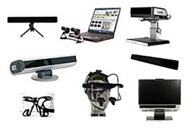
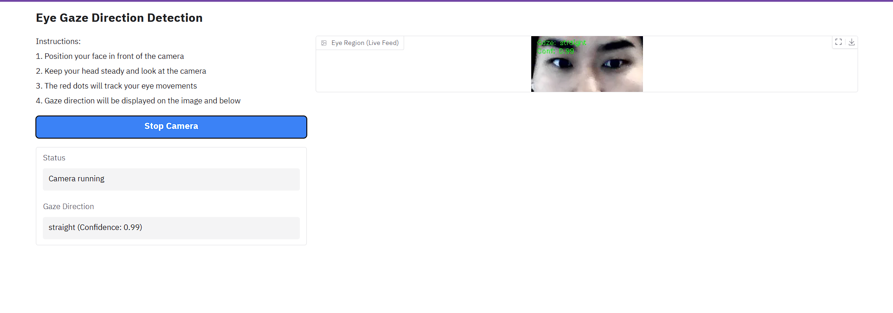
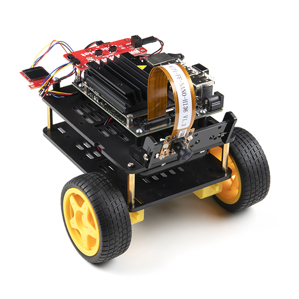
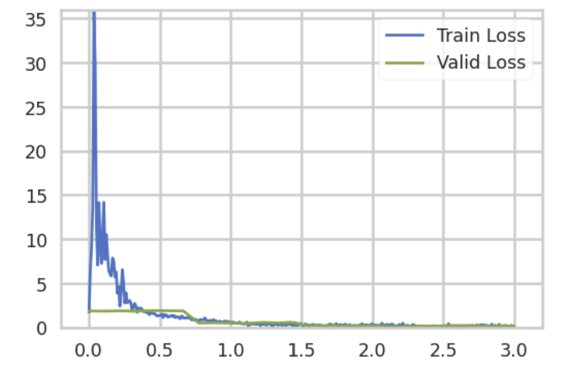
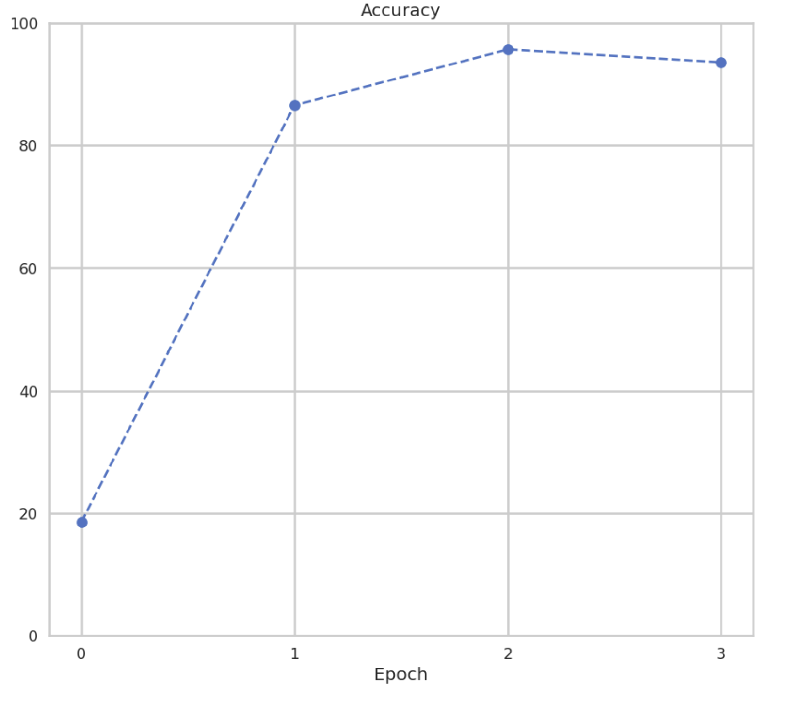
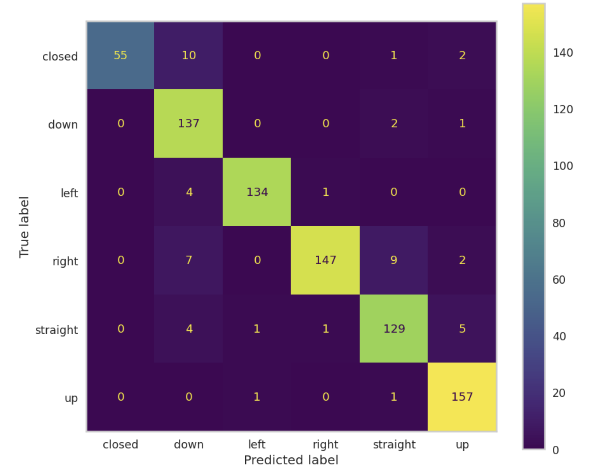

# Robo-Vision: Final Draft

## Introduction

Approximately 12.2% of Americans experience mobility disabilities, often requiring lifelong assistance [^1]. These individuals face significant challenges in maintaining independence and autonomy, frequently relying on assistive technologies to regain control over their environment. However, many existing technologies, such as joystick-controlled wheelchairs or voice-command systems, are limited for individuals with restricted dexterity [^2].

    

Eye tracking is an emerging technology has became popular due to its abiltity to monitor and record where a person's gaze is directed, allowing researchers to analyze visual attention patterns and interactions. It has helped provide insights into human perception and behavior through specialized hardware/software that tracks eye movements and can used to provide accessbility to those in need. Eye tracking presents a promising alternative, enabling individuals to navigate and interact with their surroundings without the need for external limb movement. However, current solutions often rely on overly expensive commercial eye-trackers, infrared cameras, or high-quality images which are inaccessible to many users [^5]. We believe that Convolutional Neural Networks (CNNs) offer an opportunity to enhance affordability and accessibility by utilizing computer vision techniques for gaze estimation. CNN-based methods have already shown great adaptability to variations in lighting and head poses, which makes them suitable for real-world applications. Additionaly, using CNNs for gaze tracking eliminates the need for extensive user calibration, further increasing its accesibility [^3]. Recent works show that deep learning methods can improve gaze estimation accuracy, even in challenging conditions [^4]. Nonetheless, CNN based methods can lose important spatial information through pooling layers, limiting their ability to capture both local and global eye features. This has motivated researchers to investigate new architectures that preserve such details. In particular the Swin Transformer, has shown powerful modeling capabilities while keeping computational complexity lower with a window-based self-attention [^6]. By integrating innovative approaches like this sliding window-based attention mechanism, we could enhance the adaptability and precision of gaze-based control systems.

Our research aims to develop an affordable and accurate gaze estimator using neural networks trained on a diverse population. The system is designed to have high accuracy across a wide range of demographics, correctly identify gaze directions, and map the estimated gaze to a set of coordinates that determine the user’s focus on a screen. By integrating CNN-based techniques and the attention mechanisms described, we seek to improve the accuracy, affordability, and accessibility of gaze-based control systems.

While other similar works often rely on expensive commercial eye trackers and infrared cameras to translate eye gaze into basic controls, our team’s approach focuses on the key aspects of affordability and accessibility. Instead of requiring often inaccessible, specialized hardware, our project allows users to utilize standard webcams and deep learning models like CNNs and the Swin Transformer to classify general gaze direction in real time.
Many of the existing systems also require precise calibration and can be too complicated for everyday users to set up, making them inefficient and exhausting for those with limited dexterity. Our project works to eliminate this need for extensive calibration by using computer vision and preprocessing techniques, which help standardize input into our models and reduce the amount of effort required to operate. In other words, our project differs from other work by prioritizing real-world usability and minimal hardware requirements to offer a more inclusive alternative to traditional eye-tracking solutions.

## Ethical Considerations
Our project aims to develop a neural network that can track a user's eye movement and classify their gaze direction and eye status.  This project is impactful to innovate within the way how users can interact with hardware and could improve accessiblity of tasks to user with disabilites. However, here are several ethical considerations that must be addressed when developing and deploying this technology. Key concerns include privacy, bias, accessibility, security, and transparency.

Privacy is a primary concern, as gaze-tracking technology involves collecting and analyzing sensitive biometric data. To protect user information, we will implement data anonymization protocols to ensure that personally identifiable information is never retained. Users will be fully informed about how their data is collected, used, and stored, with explicit consent obtained before any data collection. Additionally, users will have the ability to opt out and request data deletion at any time, ensuring control over their personal information.

Addressing bias in model training is crucial to ensuring that our system performs reliably for all users. It tends to be that gaze-estimation models have higher error rates for people with darker skin tones, smaller eyes, or those who wear glasses. To mitigate this, we will use a diverse dataset that represents various ethnic backgrounds, eye structures, lighting conditions, and head positions. We will continuously evaluate model performance across demographic groups and apply different machine-learning techniques to reduce disparities in accuracy.

Security risks and potential misuse must also be carefully considered. Gaze-tracking technology could be exploited for unauthorized surveillance or data collection if not properly restricted. To prevent this, we will design our system with clear safeguards, ensuring that gaze-based tracking is limited to assistive applications with explicit user consent. Moreover, data access will be restricted.

Finally, transparency in deployment is critical to building trust for technology. Many machine learning models make their decision-making process difficult to interpret. To address this, we will document how our model functions and provide explanations for its classifications.

Our goal is not only to develop an effective solution but to do so in a way that is ethical, inclusive, and beneficial to those who need it most.
 
## Methods
We began by identifying the datasets we planned to use to train our models. We selected two publicly available datasets: the Mendeley Eye-Tracker dataset and the MRL Eye dataset. The Mendeley dataset contains 7,500 evenly distributed images labeled according to five gaze directions—left, right, up, down, and straight—captured using standard camera equipment which can be found [here](https://www.kaggle.com/datasets/imadeddinedjerarda/mrl-eye-dataset). The MRL Eye dataset, found [here](https://www.kaggle.com/datasets/serenaraju/yawn-eye-dataset-new), focuses specifically on differentiating between open and closed eyes, making it particularly useful for blink detection. Together, these datasets allowed us to build and train our neural network without the need for complex preprocessing, while ensuring a reasonable level of diversity in eye shape, lighting, and head orientation. In addition to these resources, we created a Google Form to collect custom images from peers, asking for six images per category: looking up, down, left, right, forward, and eyes closed. This would not only expand our dataset but address some bias from the people the data were collected from.

To ensure consistent input during real-time inference, we implemented an eye-bounding script from Francisco's 2024 SURP project called *Eyes In Motion*. This script uses dlib’s pretrained facial landmark detection model to identify and extract the eye regions based on specific landmark points. While the dlib model does not support gaze classification, it effectively localizes key facial features. Our script isolates the eye region and applies a series of linear transformations to normalize orientation, helping to standardize the appearance of all eye images prior to classification.

We anticipated several potential challenges in the course of the project. A key concern was dataset bias, particularly with regard to underrepresented demographics or eye types, which could affect model performance. In addition, we considered the limitations of deploying our system on low-power hardware, such as the small-scale robot we intended to use, which might not support complex real-time inference efficiently.

Our next major task was implementing and training the Swin Transformer model. We began by following this [tutorial](https://medium.com/thedeephub/building-swin-transformer-from-scratch-using-pytorch-hierarchical-vision-transformer-using-shifted-91cbf6abc678) to understand the architecture, then adapted the code to our application. Following suite, our class assignments which trained similar models were designed for the CIFAR-10 dataset, and thus we had to modify the data loading pipeline to accommodate our dataset using PyTorch’s `ImageFolder` format. Once our data pipeline was working, we configured and instantiated the Swin Transformer model with custom layers suited to our six-class classification task.

We similarly trained a CNN using a combination of the two datasets to classify eye images as one of the categories we mentioned earlier. Despite our dataset being large in size, we experienced a limitation as it consisted of very few subjects. For example, the Mendeley dataset contained 7500 images but only included 12 different subjects. We believe this was causing our model to overfit greatly so in an effort to improve generalization, we applied transformations like random cropping and resizing to the images. These image transformations slightly decreased the direct accuracy of the model from about 99% to 96%, but the new loss chart displayed graphs that were overall less indicative of overfitting. The CNN was created using 3 convolutional layers and a final fully connected layer to act as the classifier. 

Training the model itself had a few difficulties. Our initial attempts with large batch sizes led to out-of-memory errors on the GPU. We progressively reduced the batch size—from 5000 to 500, and eventually to 128—until training became stable. While the smaller batch size may have impacted performance slightly, the model still achieved strong results.

After generating our models, we decided to utilize Gradio as the web interface to process the model based on your device's webcam feed and classify the eye movements to guide the robot. By integrating Gradio with our trained model, we could provide an interactive experience where users could see the model's predictions on their eye movements through their webcam feed. In order to detect a user's eyes within the web stream, we utilized an existing face detection model from dlib that applied landmarks to a user's face. We could then identify where a user's eyes were by focusing on certain landmarks. Francisco applied this pretrained model to a python script to detect a user's eyes and isolate them into a smaller window screen which also had a few linear transformations applied to it to uniformly orient all images. This python file was developed in the Summer of 2024 by Francisco as part of his SURP project for Eyes In Motion.

For the gradio interface, we wanted a simple way for users to be able to control the robot themselves. Calling our application Eye Gaze Direction Detection, this interface as a web application that leveraged computer vision and deep learning for real-time eye tracking. Our system captured periodic image frames through a webcam to mimic a video feed and used the dlib library to detect facial landmarks, effectively isolating eye regions for processing. We then implemented the two different deep learning models that we created and stored as pickle files, a custom CNN and a Swin Transformer, to predict gaze direction.  We classified it into multiple categories including left, right, up, down, straight, and closed. The frames would start processing based on a start and stop button that triggered a javascript function to continuously predecit each frame. Our frame image processing techniques incorporated frame rotation to normalize eye orientation, region cropping and resizing, and fixed bounding box calculation for consistency. We solved the refresh challenge common in web-based video of getting continuous real time prediciton by inserting a javascript listener that triggered a function to update the video feed every 1000 milliseconds. This allowed us to have a real time prediction of the user's eye movements and blink detection. The model's prediction and confidence of the prediciton were displayed on the Gradio interface, providing users with immediate feedback on their gaze direction.

THe Gradio interface displays a clean, organized two-column layout with clear user instructions, a primary video display showing processed eye regions with overlay information, and real-time gaze predictions with confidence scores. We designed it so users could easily control the system with a simple start/stop camera button, while status indicators showed the current system state. Additonally, we included robust error handling and a comprehensive debug system using debug_print statements. 

    

In the final stages of the project, we worked on deploying the model to a JetBot robot using the SparkFun Qwiic Motor Driver. This phase was met with persistent issues in building the required Docker image. One major challenge involved the `base_image_version` variable not updating correctly, which we initially fixed by using`sudo export`. However, further errors kept popping up, particularly wRith public key verification for Kitware dependencies. We attempted to resolve these issues by editing the Dockerfile and manually importing the necessary keys, but these fixes were not sufficient. As a last resort, we decided to reflash the JetBot’s SD card using SD Card Formatter and Etcher with the official NVIDIA image. After reestablishing Wi-Fi connectivity, we were able to configure the base image version correctly and complete the Docker build process by manually specifying and verifying the required public keys. This successful reinstallation has yet to lead to a working docker image for easy coding.

    

## Discussion and Results

Firstly, we examined the training and validation loss for our Swin Transformer model.  
  
As seen in the image above, our training loss initially started quite high; however, as training progressed, both the training and validation loss steadily decreased to below 0.5. Notably, the validation loss remained low without any significant increase in later epochs, suggesting that the model successfully avoided overfitting.

Next, we evaluated the model's classification accuracy. Overall, the Swin Transformer achieved approximately 95% accuracy across all gaze categories. The per-class accuracy was as follows:  
- *Closed*: 80.9%  
- *Down*: 97.9%  
- *Left*: 96.4%  
- *Right*: 89.1%  
- *Straight*: 92.1%  
- *Up*: 98.7%  

  
These results indicate strong performance across most classes, with slightly lower accuracy in the "closed" and "right" categories. This discrepancy may be due to the visual similarity between closed eyes and downward gaze, which was further examined using the confusion matrix.

  
As shown above, the confusion matrix reveals that the most common misclassifications occurred between the “closed” and “down” classes. This likely stems from the inherent visual similarity between eyes that are fully closed and those that are partially visible while looking downward. Regardless though, the model demonstrated a strong ability across the remaining gaze directions.

Despite strong overall performance, our model exhibited notable disparities in accuracy when evaluated on individuals from certain ethnic backgrounds. During testing, we observed that the model underperformed significantly for users with specific racial features, such as monolids or darker skin tones. This suggests that the datasets used for training may lack sufficient diversity, leading to biased performance that favors certain demographic groups over others. These disparities highlight a critical limitation in our model’s generalizability and underscore the need for more inclusive data collection practices moving forward.

In creating the gradio interface, we learned through a lot of challenges of trying to create seamless livefeeds and how to properly implement the javascript functions to make it work. We tried to use gradio's webstream object to process the frames but it was not working as we expected. We had to pivot to utiilzing javascript functions to make the webstream work and how to properly implement the start/stop button to trigger the javascript function to process images of the webcam frequently enough to simulate a webcam feed. We also learned how to properly implement frame image processing techniques to make it work with the webcam image such as properly bounding our eyes and making sure that the images were properly rotated and cropped to be able to classify them correctly. Other challenges we overcame is properly loading and configuring the gradio to take in two separate CNN models, trying to run it on cpu vs cuda, and currently, connecting it to the robot itself.

Our initial CNN did not include a step to apply transformations to the images. This version of the model was able to achieve up to 99.6% validation accuracy, which was immediately a red flag. Upon a closer inspection of the losses, we noticed that while the training loss continued to gradually decrease over time, the validation loss started really small and began to increase as soon as the second epoch. This is a clear indication of potential overfit in the model. Adding the image transformations, as we mentioned, appeared to have an immediate impact on the model. The loss plots appear more normal and reasonable, and we still managed to have a high accuracy of 98.8% after 10 epochs. However, the high accuracy combined with the low variability of our otherwise large dataset leads us to believe that either the problem we are tackling is easier than anticipated or the limitations of our dataset are still causing our model to overfit on the training data.

## Conclusion
Robo-Vision represents a significant advancement in the integration of neural networks and robotics. By accurately classifying gaze and translating it into robotic actions, the system demonstrates both technical excellence and adherence to ethical standards. Future work will focus on enhancing the model's generalization capabilities and exploring its application in diverse domains, such as assistive technologies and human-computer interaction.

# Reflection 

In the future, we believe it’s important to make an earlier decision about whether a particular user interface is the best choice for our application. We found that Gradio wasn’t necessarily the best option, as it doesn't support multiple live image feeds and introduces noticeable lag when applying the transformations needed to prepare images for our model. This slowed down our real-time classification and reduced overall responsiveness.

We also think that getting the robot working much earlier in the process would have made testing significantly easier. Being able to send directions across devices and see the robot respond in real time would have helped us debug and refine our system more effectively.

To continue this work, we would move away from Gradio and instead run the application directly on the user’s computer. This would allow all processing to happen locally, reducing lag and improving performance. We would also build more advanced robot scripts to support more complex movement based on the six classifications. Lastly, we would expand the dataset to be more inclusive to reduce bias and improve accuracy across a broader range of users.

## Future Direction and Work / Before Final Submission

* Work on a script for the robot to be controlled by the output classification from the eyes
* Get the jetbot to be able to actually run the code
* Get gradio to stream the jetbot live feed

# References:
[^1]: “Disability impacts all of us infographic,” Centers for Disease Control and Prevention, https://www.cdc.gov/disability-and-health/articles-documents/disability-impacts-all-of-us-infographic.html?CDC_AAref_Val=https%3A%2F%2Fwww.cdc.gov%2Fncbddd%2Fdisabilityandhealth%2Finfographic-disability-impacts-all.html (accessed Mar. 4, 2025). 

[^2]: M. Dahmani et al., “An intelligent and low-cost eye-tracking system for motorized wheelchair control,” Sensors, vol. 20, no. 14, p. 3936, Jul. 2020. doi:10.3390/s20143936 

[^3]: A. Kar and P. Corcoran, “A review and analysis of eye-gaze estimation systems, algorithms and performance evaluation methods in consumer platforms,” IEEE Access, vol. 5, pp. 16495–16519, 2017. doi:10.1109/access.2017.2735633 

[^4]: Y. Cheng, H. Wang, Y. Bao, and F. Lu, “Appearance-based gaze estimation with Deep Learning: A review and benchmark,” IEEE Transactions on Pattern Analysis and Machine Intelligence, vol. 46, no. 12, pp. 7509–7528, Dec. 2024. doi:10.1109/tpami.2024.3393571 

[^5]: Y. Xia, B. Liang, Z. Li, and S. Gao, “Gaze estimation using neural network and logistic regression,” The Computer Journal, vol. 65, no. 8, pp. 2034–2043, May 2021. doi:10.1093/comjnl/bxab043 

[^6]: Y. Li, J. Chen, J. Ma, X. Wang, and W. Zhang, “Gaze estimation based on convolutional structure and sliding window-based attention mechanism,” Sensors, vol. 23, no. 13, p. 6226, Jul. 2023. doi:10.3390/s23136226 
