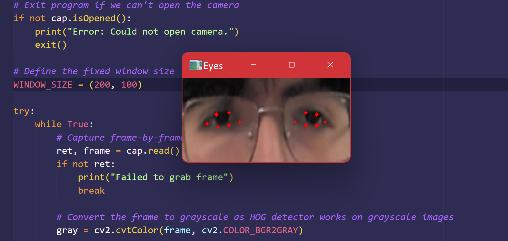

# Title: NN Robo-vision

### Group Members: Francisco Morales, Luis Mendoza, and Haram Yoon

## Project Summary: 

    
    

This project focuses on training a neural network (NN) to track a user's eye movement and classify their gaze direction and eye status. The model will take input from a camera and determine whether a user is blinking, looking forward, left, right, down, or up.  

To achieve this, a dataset of eye images will be collected and labeled, ensuring diversity across individuals, lighting conditions, and head positions. The trained NN will then be tested in real-time on different cameras to evaluate its accuracy across various users and conditions.  

This research builds on my previous work in assistive robotics, where I explored gaze-based control for navigation however without using any ML. The ability to accurately estimate gaze direction could further enable hands-free control in assistive technologies and human-computer interaction applications.  

## Project Outline:

### Introductory paragraph: What is the problem and why is it relevant to the audience attending THIS CONFERENCE? Moreover, why is the problem hard, and what is your solution? You must be brief here. This forces you to boil down your contribution to its bare essence and communicate it directly.

* Approximately 12.1% of Americans have mobility disabilities, including conditions like cerebral palsy, spinal cord injuries, and quadriplegia, which severely impact daily activities and independence. These impairments often require lifelong care due to motor disabilities and muscle control issues. Although people themselves may not be impacted directly by many of these afflictions, robotics and machine learning are one of the few tools that can help these individuals regain their freedom. 

* This problemm is hard to solve because of the intricacies behind movemento and the difficulty in the limitations that one with impaired movement have with control hardware. Our solution is to create a gaze estimator **NN Robo-vision** that can classify a user's gaze in real time, and in doing so translate complex movements to some viable with only eyes. 

### Background paragraph: Elaborate on why the problem is hard, critically examining prior work, trying to tease out one or two central shortcomings that your solution overcomes.

* The problem is hard because of just how limiting and inefficient systems can be in translating eye movement to real and meaningful controls. In the past, software has been made for commercial eye trackers that can translate someone's gaze to simple controls for a wheelchair. However, these are extremely expensive and sometimes taxing for the user as every small movement requires far more effort than what is efficient.

### Transition paragraph: What keen insight did you apply to overcome the shortcomings of other approaches? Structure this paragraph like a syllogism: Whereas and, infer.

* While lots of eye tracking technology for accesibility already do exist, we understand that the expensive equipment required can pose a financial barrier to many people living with disabilities. As such, our project aims to create a cost-effective software that can run using only a webcam.

### Details paragraph: What technical challenges did you have to overcome and what kinds of validation did you perform?

* Using regular web cameras instead of top of the line eye tracking equipment, makes it more difficult to properly track and classify movements.

### Assessment paragraph: Assess your results and briefly state the broadly interesting conclusions that these results support. This may only take a couple of sentences. I usually then follow these sentences by an optional overview of the structure of the paper with interleaved section callouts.

* Implementing this gaze estimator with non-comercial webcames allows for software to be built using this model as a basis for intricate control systems without having to rely on expensive equipment. Moreover, our results show how these inexpensive equipment is actually a viable tool with a really high accuracy score (Ideally over 90% accuracy).

## Ethical Sweep

Our project aims to develop a neural network that can track a user's eye movement and classify their gaze direction and eye status. This project is impactful to innovate within the way how users can interact with hardware and could improve accessiblity of tasks to user with disabilites. However, here are several ethical considerations that must be addressed when developing and deploying this technology. 

Some ethical conerns include privacy as each user's data should be protected and all users should be properly informed about how their data is being use. To prevent infringing on our users' privacy and anonymity, we will ensure that all data is protected and that all users are properly informed about how their data is being used.

Another conern is potential bias in the data and model as the model may react differently to different groups of people and types of eyes. We expect that the model may have different error rates for different sub-groups in the data. For example, the model may have a higher error rate for people with darker skin tones, smaller eyes, or people with glasses. We would mitigate this by ensuring that our data is diverse and representative of types of eyes and the model reacts the same to different people. Our diverse team of three will ensure that our model is not biased and that we are able to handle any appeals or mistakes that may arise through having diverse testing data.

## Updated Ethical Sweep:

Our project aims to develop a neural network that can track a user's eye movement and classify their gaze direction and eye status.  This project is impactful to innovate within the way how users can interact with hardware and could improve accessiblity of tasks to user with disabilites. However, here are several ethical considerations that must be addressed when developing and deploying this technology. Key concerns include privacy, bias, accessibility, security, and transparency.

Privacy is a primary concern, as gaze-tracking technology involves collecting and analyzing sensitive biometric data. To protect user information, we will implement data anonymization protocols to ensure that personally identifiable information is never retained. Users will be fully informed about how their data is collected, used, and stored, with explicit consent obtained before any data collection. Additionally, users will have the ability to opt out and request data deletion at any time, ensuring control over their personal information.

Addressing bias in model training is crucial to ensuring that our system performs reliably for all users. It tends to be that gaze-estimation models have higher error rates for people with darker skin tones, smaller eyes, or those who wear glasses. To mitigate this, we will use a diverse dataset that represents various ethnic backgrounds, eye structures, lighting conditions, and head positions. We will continuously evaluate model performance across demographic groups and apply different machine-learning techniques to reduce disparities in accuracy.

Security risks and potential misuse must also be carefully considered. Gaze-tracking technology could be exploited for unauthorized surveillance or data collection if not properly restricted. To prevent this, we will design our system with clear safeguards, ensuring that gaze-based tracking is limited to assistive applications with explicit user consent. Moreover, data access will be restricted.

Finally, transparency in deployment is critical to building trust for technology. Many machine learning models make their decision-making process difficult to interpret. To address this, we will document how our model functions and provide explanations for its classifications.

 Our goal is not only to develop an effective solution but to do so in a way that is ethical, inclusive, and beneficial to those who need it most.

## Project Goals

1. **Create a dataset** containing images from multiple individuals, capturing different gaze directions and eye statuses under varied conditions.  
2. **Train a neural network** to accurately classify eye movement directions and blinking states.  
3. **Test the model** across different cameras and user environments to verify general condition.  
4. **Optimize performance** to ensure real-time responsiveness.  

